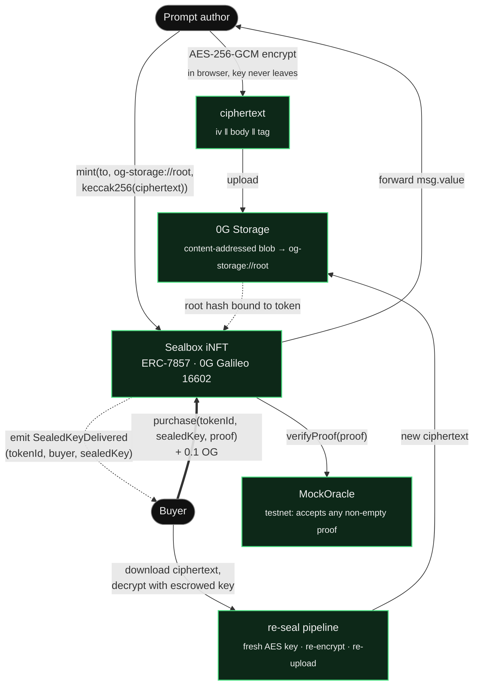
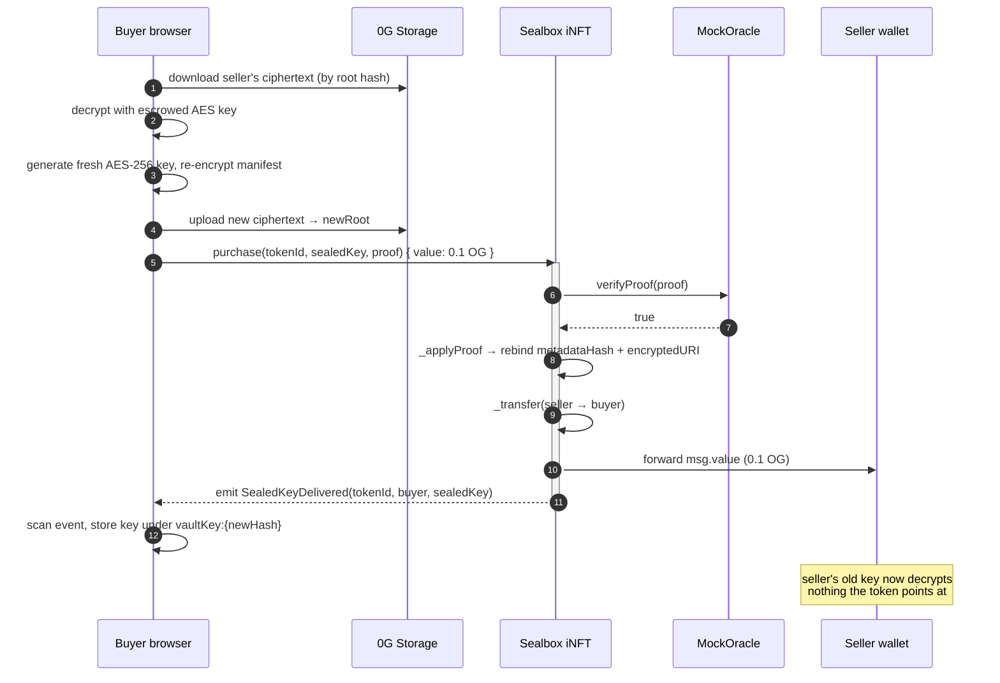

# Sealbox

**A prompt is not a file you sell. It's an access you transfer.** Sealbox makes a system prompt or agent config a real digital asset — an **ERC-7857 iNFT** whose encryption key re-seals to the buyer on every purchase. The moment the sale confirms, the seller cryptographically cannot decrypt the prompt anymore. Atomic loss of access, enforced by the contract, not by policy.

## The problem

A good system prompt has real economic value and zero defensibility. Screenshots leak it instantly. PromptBase resells text you can copy on sight. OpenAI's Custom GPTs let you *publish* a prompt, never *sell* it. There has never been a primitive for transferring the **access** to an opaque artifact — atomically, on-chain, with provable loss-of-access for the person selling it. So the people sitting on valuable prompt libraries — prompt engineers, AI consultants, agent builders — have no way to monetize them beyond renting a SaaS wrapper.

## The solution

Sealbox stores the prompt body as AES-256-GCM ciphertext on **0G Storage** and mints an **ERC-7857 iNFT** that points at it by content hash. Holding the token is the only way to get the key. On purchase, the buyer's browser re-encrypts the prompt under a **fresh key bound to them**, re-uploads the ciphertext, and calls `purchase()` — one payable transaction that rebinds the token's metadata, transfers ownership, and forwards **0.1 OG straight to the seller**. The seller's old key now decrypts nothing the contract points at.

**For the author:** list once, get paid on every sale, and know the buyer can't just resell your plaintext because they never received your ciphertext — they received a re-sealed copy.
**For the buyer:** hold the token, decrypt client-side, plug the prompt into any LLM. Rent it out with `authorizeUsage()`; revoke in one tx.

## Deployment status

**Live on 0G Galileo testnet (chain `16602`).** Contracts deployed, 4 prompts seeded, `purchase()` exercised end-to-end.

| Contract | Address |
| --- | --- |
| `Sealbox` iNFT (ERC-7857, symbol `SEAL`) | [`0xCb3240F9EdE4A0F2407325a3d1144D87C0d6fD64`](https://chainscan-galileo.0g.ai/address/0xCb3240F9EdE4A0F2407325a3d1144D87C0d6fD64) |
| `MockOracle` (re-encryption proof verifier) | [`0x90761A1F9Cc15395410e5A27eE2AC5b10ecF4168`](https://chainscan-galileo.0g.ai/address/0x90761A1F9Cc15395410e5A27eE2AC5b10ecF4168) |
| Deployer | [`0x4f687f3481a36586608367bDd19a13D712B5f623`](https://chainscan-galileo.0g.ai/address/0x4f687f3481a36586608367bDd19a13D712B5f623) |

The iNFT is open-mint (any wallet) with a flat `LISTING_PRICE` of **0.1 OG**. Seed prompts are tokenIds `1–4` — see [`app/lib/seedListings.ts`](app/lib/seedListings.ts).

## Architecture



Green = built and deployed. The re-seal pipeline is what makes ownership *cryptographic* rather than nominal: the buyer's key only means something once the seller's ciphertext is orphaned.

## What `purchase()` actually does — one atomic transaction



The **mock-only** piece is how the seller's AES key reaches the buyer. Today the seller escrows it publicly alongside the listing (localStorage for user mints, bundled in the repo for seed prompts) so the buyer can run the re-encryption client-side. Production swaps this for **ECIES to a buyer-published pubkey** — the contract surface is unchanged.

## Contract surface

| Function | Who | Effect |
| --- | --- | --- |
| `mint(to, encryptedURI, metadataHash)` | anyone | Mints an iNFT bound to a 0G Storage blob. Key generated client-side, never on-chain. |
| `purchase(tokenId, sealedKey, proof)` `payable` | any non-owner | Pays exactly `LISTING_PRICE`; oracle-verifies `proof`; rebinds metadata; transfers token; forwards payment to seller; emits `SealedKeyDelivered`. |
| `transfer(from, to, tokenId, sealedKey, proof)` | current owner only | Seller-initiated sealed transfer. `msg.sender == from == ownerOf(tokenId)` — blocks proof-replay theft. |
| `clone(to, tokenId, sealedKey, proof)` | token owner | Mints a re-sealed copy; source token untouched. For agent templates. |
| `authorizeUsage(tokenId, executor, permissions)` / `revokeUsage(...)` | token owner | Scoped, revocable rental without transferring ownership. |

Events: `Minted`, `Purchased`, `SealedTransfer`, `SealedKeyDelivered`, `MetadataUpdated`, `Cloned`, `UsageAuthorized`, `UsageRevoked`.

## App routes

| Route | Purpose |
| --- | --- |
| `/` | Landing — pitch and feature grid |
| `/prompts` | Sealbox console — your iNFTs: mint / reveal / sell / rent |
| `/market` | Marketplace — live on-chain listings, one-click 0.1 OG buy |
| `/templates` | Starter prompts you can fork and mint |
| `/features` | The six load-bearing pieces (storage, identity, compute, access, UX, trade) |
| `/pitch` | Pitch deck |

## Repository

```
sealbox/
├── contract/
│   ├── contracts/
│   │   ├── ERC7857.sol          # the Sealbox iNFT
│   │   └── MockOracle.sol       # testnet proof verifier
│   ├── scripts/
│   │   ├── deploy.cjs           # MockOracle + ERC7857
│   │   └── seed-prompts.cjs     # encrypt → 0G Storage → mint ×4
│   └── test/ERC7857.test.cjs    # 13 passing
├── app/
│   ├── market/page.tsx          # live listings + one-click purchase()
│   ├── prompts/page.tsx         # console: mint / reveal / transfer / authorize
│   ├── lib/
│   │   ├── contract.ts          # viem/wagmi bindings + addresses
│   │   ├── crypto.ts            # WebCrypto AES-256-GCM
│   │   ├── ogStorage.ts         # 0G Storage upload/download
│   │   ├── reseal.ts            # decrypt → re-encrypt → re-upload
│   │   ├── seedListings.ts      # pre-minted catalog (tokenIds 1–4)
│   │   └── signer.ts            # viem WalletClient → ethers v6 signer
│   └── api/query/route.ts       # server proxy to 0G Compute Router (TEE inference)
└── README.md
```

## 0G network config

| | |
| --- | --- |
| Chain ID | `16602` (0G Galileo Testnet) |
| EVM RPC | `https://evmrpc-testnet.0g.ai` |
| Explorer | `https://chainscan-galileo.0g.ai` |
| Faucet | `https://faucet.0g.ai` |
| Storage indexer | `https://indexer-storage-testnet-turbo.0g.ai` |
| Native token | `OG` |

## Local development

```bash
npm install
npm run dev          # http://localhost:3000
```

Connect a wallet holding Galileo OG, open `/market`, click Buy on any seeded prompt. Optional: copy `.env.example` → `.env.local` and set `OG_ROUTER_API_KEY` to enable TEE inference on `/api/query`.

### Redeploy / re-seed

```bash
cd contract
npm install
npm test                 # 13 passing
npm run deploy:galileo   # needs PRIVATE_KEY in contract/.env, funded with OG
npm run seed:galileo     # mints the 4 sample prompts, prints the seed block
```

After a redeploy: paste the new addresses into `INFT_ADDRESS` / `ORACLE_ADDRESS` in `app/lib/contract.ts`, update `INFT_ADDRESS` in `contract/scripts/seed-prompts.cjs`, then refresh `SEED_LISTINGS` in `app/lib/seedListings.ts` with the tokenIds, storage roots, keys, and metadata hashes from the seed output.

## Security notes

- **Oracle is a mock.** `MockOracle.verifyProof` returns `true` for any non-empty bytes. Anyone with the escrowed AES key + 0.1 OG can take a token (the seller still gets paid). Production needs a TEE- or DA-backed verifier.
- **Seed keys are public by design.** They're committed in `seedListings.ts` so the demo works with zero setup — the original plaintext is therefore in git history forever. "Seller loses access" holds against the *re-sealed* ciphertext, not the original.
- `transfer()` requires `msg.sender == from == ownerOf(tokenId)` — proof-replay theft is blocked at the contract level.
- `mint()` is open; requires non-zero `to`.

## Tech stack

Next.js 16 (App Router, Turbopack) · TypeScript · Tailwind v4 · RainbowKit + wagmi + viem · ethers v6 · Hardhat + OpenZeppelin v5 · 0G Storage TS SDK · 0G Compute Router (TEE inference).
